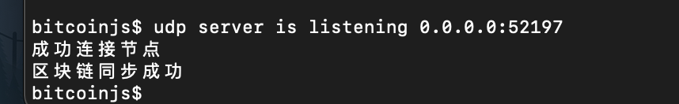
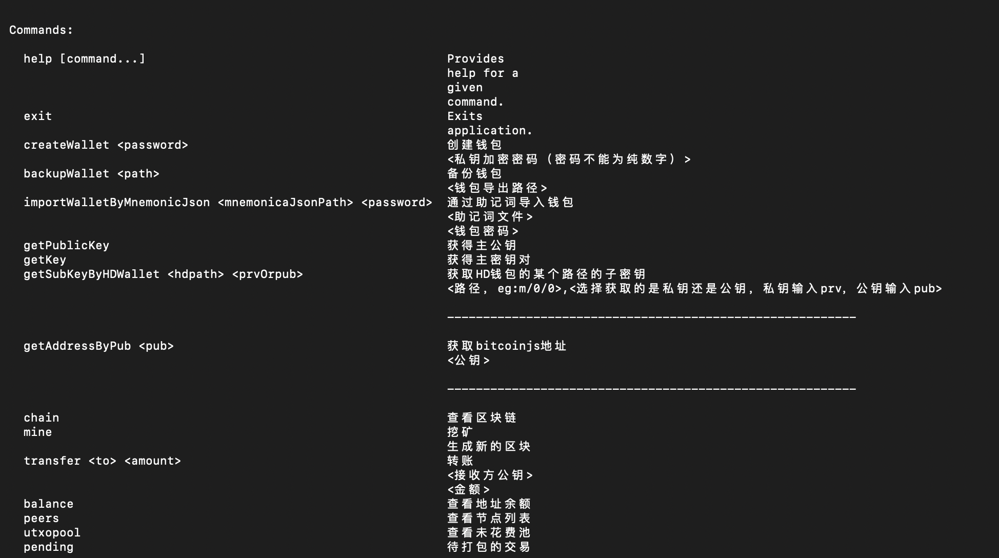
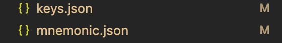

                                                   ########################################################################

              ##############                                #######
                        ###                               ##
                      ###                                ##
                    ###                                 ##
                  ###                                    ##
                ###                                       ##
              ##############                                #######

                                                        ########################################################################
          zcoin@v0.0.1 is a similar bitcoin system run at nodejs
# 简介
   该项目是我通过学习 [《精通比特币》](https://www.8btc.com/book/281955)一书并通过自己对比特币核心原理的理解，编写的一个模仿比特币系统的我自己的虚拟货币系统，主要用来学习。若存在不足，还请谅解并指出。
# 开始
1、进入zcoin目录，安装依赖包：
```
npm i
````
2、如果向将程序作为zcoin的服务种子节点，可通过指定端口。该程序服务种子节点端口为：8001
```
npm start 8001
```
3、如果不想作为种子节点，可不用指定端口，系统会自动为你分配动态端口，只需执行
```
npm start 
```
至此，zcoin系统就成功运行了，系统会自动搜索在线的网络节点，并请求同步最
新的区块链数据



这里就是zcoin的菜单



# 创建HD钱包
zcoin系统也实现了bicoin的HD钱包功能，主要是用来生成用户的地址，可通过createHDWallet </password/>命令创建，命令会生成两个文件，一个key.json用来存储种子密钥和主密钥。另一个mnemonic.json文件储存zcoin产生的助记词文件，以及密码的hash值（用来备份钱包，导入钱包使用）

到这里就可以使用该zcoin系统进行挖矿等转账操作啦！！！
# 其他
系统详细的技术实现我将以章节的形式更新
# 尾声
如果大家觉得有用的话，可以star下哟！！！！！

